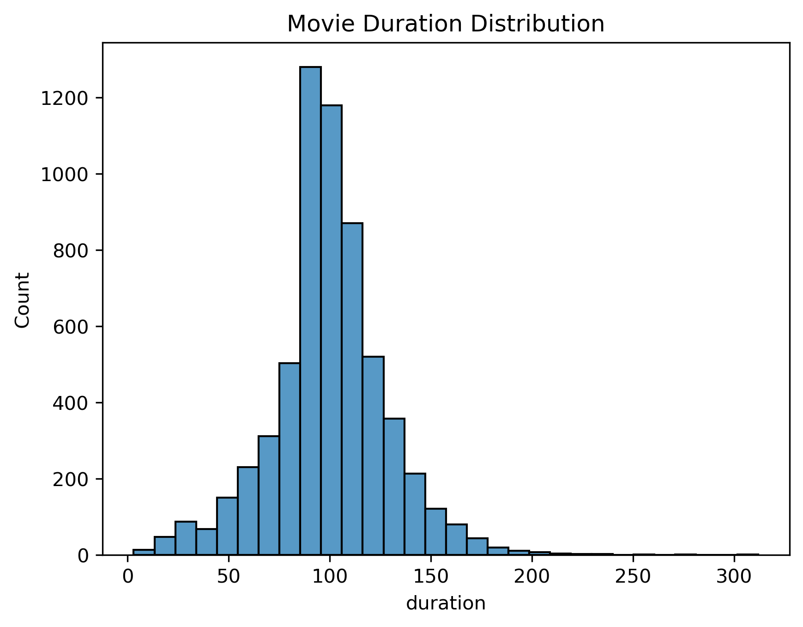
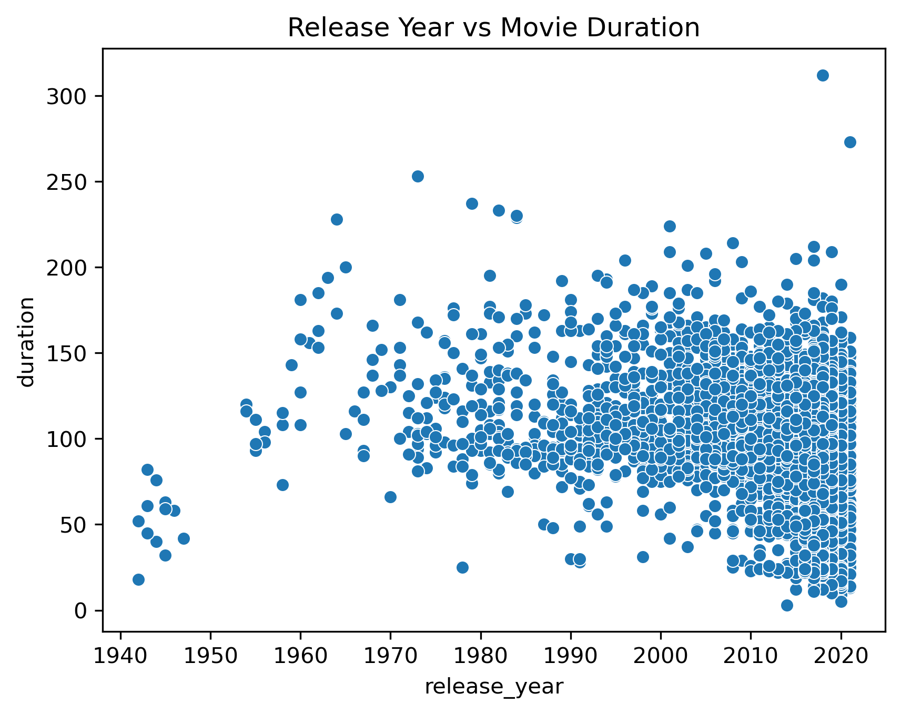

# Netflix Statistical Analysis

## Project Overview

This project performs **statistical analysis on Netflix movie data** to understand patterns in movie duration and how it relates to other variables such as release year.

The analysis applies several statistical techniques including **descriptive statistics, hypothesis testing, correlation analysis, confidence intervals, and regression modeling**.

This project demonstrates practical skills in **Python, statistics, and data analysis**, which are essential for data science and analytics roles.

---

# Dataset

The dataset used in this project is the **Netflix Movies and TV Shows Dataset** obtained from Kaggle.

Main variables used in this analysis include:

* Type
* Release Year
* Duration
* Country
* Rating
* Genre

---

# Tools and Libraries

The analysis was performed using Python and the following libraries:

* Pandas
* NumPy
* Matplotlib
* Seaborn
* SciPy
* Statsmodels

---

# Project Structure

```
netflix-statistical-analysis
│
├── data
│   └── netflix_cleaned.csv
│
├── notebook
│   └── netflix_statistical_analysis.ipynb
│
├── images
│   ├── movie_duration_distribution.png
│   └── duration_vs_year.png
│
└── README.md
```

---

# Data Preparation

Movie durations were cleaned and converted into numeric format for statistical analysis. Missing or invalid values were handled appropriately before performing the analysis.

---

# Descriptive Statistics

Key statistics for movie duration:

| Statistic          | Value         |
| ------------------ | ------------- |
| Mean               | 99.58 minutes |
| Median             | 98 minutes    |
| Standard Deviation | 28.29 minutes |
| Minimum            | 3 minutes     |
| Maximum            | 312 minutes   |

Most Netflix movies fall between **87 and 114 minutes**.

---

# Hypothesis Testing

Research Question:

Do Netflix movies significantly differ from the industry average of **100 minutes**?

Hypotheses:

H0: Mean duration = 100 minutes
H1: Mean duration ≠ 100 minutes

Result:

* Test: One-sample t-test
* p-value = **0.242**

Conclusion:

Since p > 0.05, we **fail to reject the null hypothesis**.
There is **no significant difference** between the average Netflix movie duration and 100 minutes.

---

# Correlation Analysis

The correlation between **release year and movie duration** is:

* **-0.206**

This indicates a **weak negative relationship**, meaning newer movies tend to be slightly shorter.

---

# Confidence Interval

The **95% confidence interval** for the true average movie duration is:

**98.87 minutes – 100.29 minutes**

This confirms that the average movie duration is approximately **100 minutes**.

---

# Regression Analysis

A simple linear regression model was built:

```
duration ~ release_year
```

Result:

* Regression coefficient = **-0.60**
* R² = **0.043**

Interpretation:

Movie duration decreases by about **0.6 minutes per year**, although the relationship is relatively weak.

---

# Key Insights

* The average Netflix movie duration is **~100 minutes**
* Most movies fall between **87–114 minutes**
* There is **no significant difference** from the 100-minute industry standard
* Newer movies tend to be **slightly shorter**
* The relationship between release year and duration is **weak but negative**

---

# Visualizations

## Movie Duration Distribution



## Release Year vs Movie Duration



---

# Skills Demonstrated

* Data Cleaning
* Exploratory Data Analysis
* Hypothesis Testing
* Statistical Inference
* Regression Modeling
* Data Visualization
* Python Data Analysis

---

# Author

Mohammad Saiful Alam
M.Sc. in Data Science & Machine Learning
Research Officer, Bangladesh Forest Research Institute
